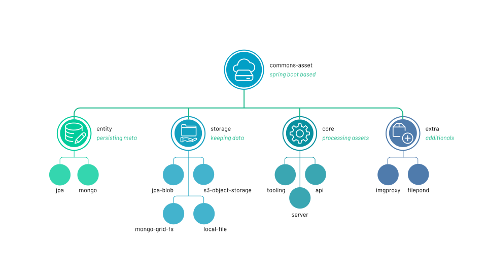

# commons-asset


[](https://travis-ci.com/rocketbase-io/commons-asset)
[](https://maven-badges.herokuapp.com/maven-central/io.rocketbase.commons/commons-asset)
[](https://codeclimate.com/github/rocketbase-io/commons-asset/maintainability)
[](https://codeclimate.com/github/rocketbase-io/commons-asset/test_coverage)

Add a flexible asset service with a bunch of features to your spring-boot applications. 

I've added a swagger api-documentation. You can find it within [src](./commons-asset-api/src/doc/swagger) of [swaggerHub](https://app.swaggerhub.com/apis-docs/melistik/commons-asset)


**Features:**
* api and controller to handle asset-uploads
* works with images: jpeg, gif, png, tiff, svg, webp, heic/heif and documents like: pdf, excel, word, powerpoint and zip
* you can configure the allowed contentTypes via property *("asset.api.types")*
* 4 different storage implementations (mongo-grid-fs / aws-s3 / jpa-blob / local-file)
* embedded thumb service with different implementations (java / command-line ImageMagick or extermal services like imgproxy/thumbor)
* java resource to communicate with api
* batch downloading urls and storing them / analyzing
* intergrated [color-thief](https://github.com/SvenWoltmann/color-thief-java) in order to get primary and other colors from photo
* optional LIQP (Low Quality Image Placeholder) option to have a placeholder for images in base64 encoded in ultra low resolution




## commons-asset-api

This module provides the DTOs and a client to communicate with the asset endpoints.
The main Objects are: **AssetReference** that is used to store in MongoDb in case of refrencing and **AssetRead** containing also the different preview urls.

***AssetReference sample:***

```json
{
    "id": "5b0f6bf23c5ded0ee5dcab57",
    "urlPath": "a/b/5/7/5b0f6bf23c5ded0ee5dcab57.jpg",
    "type": "JPEG",
    "context": "people-shoot",
    "meta": {
        "created": "2018-05-31T07:28:50.239",
        "originalFilename": "photo-1478472190689-fa020c20809a.jpeg",
        "fileSize": 1216844,
        "resolution": {
            "width": 4094,
            "height": 2730
        },
        "colorPalette": {
            "primary": "#395427",
            "colors": ["#ced5dd", "#80c9f3", "#74a043"]
        }
    },
  	"keyValues": {
      "extra": "value"
    },
  	"eol": "data:image/jpeg;base64...."
}
```

With urlPath you can calculate your preview url. The logic is been implemented in AssetConverter.toRead(...)

During upload process the file is getting read so that some meta information get stored. In case of image also the resolution is getting stored...

## commons-asset-tooling

Containing Thumbnail-Service, ColorThief, Download-Service, ImageHandler (for download images and on the fly thumbnailing + base64 converting)...

## commons-asset-core

Containing an implementation for storing asset references...

| property           | default           | explanation                                                  |
| ------------------ | ----------------- | ------------------------------------------------------------ |
| asset.api.path     | /api/asset        | base path of assetController                                 |
| asset.api.types    | *All*             | you can shrink allowed Types (is a list property)            |
| asset.api.download | true              | you can disable endpoint                                     |
| asset.api.delete   | true              | when false no delete is possible                             |
| asset.api.batch    | true              | you can disable batch endpoint                               |
| asset.api.analyse | tru | you can disable analyse endpoint |
| asset.api.preview  | true              | should only been taken in case of mongo-storage<br />please consider also using outside caching |
| asset.api.detectResolution    | true              | you can disable image resolution detection                              |
| asset.api.detectColor    | true              | you can disable image colorThief                              |
| asset.api.baseUrl  | ""                | used for previewUrls in case of mongo-storage, will get used as fallback |
| asset.api.previewQuality | XS: 0.7<br />S: 0.75<br />M: 0.8<br />L: 0.85<br />XL: 0.85 | configure quality of image preview via java-code. Its a Map<String, Float> Configuration and the key needs to match the enum PreviewSize<br /><br />ValueRange is between 0 - 1.<br />1 means 100% |

**LQIP** (Low Quality Image Placeholder) since 3.1.x there is an option to allow adding base64 thumb as a placeholder to the assetReference. During upload process the system adds it to the entity and the small thumb get stored in db as well. It should be used as placeholder before loading the main preview. To lower http calls the "binary" is already containing within the rest response. 

|                      | default | explanation                   |
| -------------------- | ------- | ----------------------------- |
| asset.lqip.enabled   | false   | by default disabled feature   |
| asset.lqip.maxWidth  | 50      | max with of the image         |
| asset.lqip.maxHeight | 50      | max height of the image       |
| asset.lqip.quality   | 0.05    | ultra low res of the image 5% |

An usecase example could be found here [codepen - low quality image placeholder](https://codepen.io/alxdr/pen/oNgKNGY)

**Shrink-options** in some cases it's useful not to store the original imagesize. Therefore some new options had been added sine 3.5.x

|                      | default | explanation                   |
| -------------------- | ------- | ----------------------------- |
| asset.shrink.enabled   | false   | by default disabled feature   |
| asset.shrink.maxWidth  | 2560      | max with of the image         |
| asset.shrink.maxHeight | 2560      | max height of the image       |
| asset.shrink.quality   | 0.9    | quality of image - default mean 90% |


### custom preview service

From version 2.2.x on we've removed our thumbor integration to open our project to multiple thumb providers. In case you would like to use your own you need to provide a custom bean within you application.

````java
/*
 * <dependency>
 *     <groupId>com.squareup</groupId>
 *     <artifactId>pollexor</artifactId>
 *     <version>2.0.4</version>
 * </dependency>
 */
@Service
@RequiredArgsConstructor
public abstract class ThumborPreviewService implements AssetPreviewService {

    protected final ThumborProperties thumborProperties;

    public String getPreviewUrl(AssetReferenceType assetReference, PreviewSize size) {
        return getThumbor().buildImage(assetReference.getUrlPath())
                .resize(size.getMaxWidth(), size.getMaxHeight())
                .fitIn()
                .toUrl();
    }

    protected Thumbor getThumbor() {
        if (thumbor == null) {
            String thumborKey = thumborProperties.getKey();
            if (thumborKey.isEmpty()) {
                thumbor = Thumbor.create(thumborProperties.getHost());
            } else {
                thumbor = Thumbor.create(thumborProperties.getHost(), thumborKey);
            }
        }
        return thumbor;
    }

}
````


## commons-asset-entity-mongo

Implementation for MongoRepository + Mongo Entity...

## commons-asset-entity-jpa

Implementation for JpaRepository + Jpa Entity...

## commons-asset-storage-fs

Local-FileStorageService

|                    | default      | explanation                             |
| ------------------ | ------------ | --------------------------------------- |
| asset.fs.base-path | **required** | required base start path to store files |

## commons-asset-storage-jpa

Stores files as blob in database.

## commons-asset-storage-mongo

Store files in mongo-database with grid-fs

## commons-asset-storage-s3

Containing a communication layer with s3 in order to use it as file storage. Uses the official [aws-java-sdk-s3](https://aws.amazon.com/de/sdk-for-java/)

| property                           | default      | explanation                                                  |
| ---------------------------------- | ------------ | ------------------------------------------------------------ |
| asset.s3.bucket                    | **required** | bucket name where files should get stored                    |
| asset.s3.access-key                | **required** |                                                              |
| asset.s3.secret-key                | **required** |                                                              |
| asset.s3.region                    | **required** |                                                              |
| asset.s3.endpoint                  | *optional*   | allow to connect to replacements of aws s3<br />by for example  [minio](https://www.minio.io/) you can specify the endpoint |
| asset.s3.instance-profile          | *optional*   | property to configure aws-java-sdk                           |
| asset.s3.path-style-access-enabled | *optional*   | property to configure aws-java-sdk                           |
| asset.s3.signer-override           | *optional*   | property to configure aws-java-sdk                           |

### examaple configs

```yaml
## minio
asset:
	s3:
		access-key: XXX
		secret-key:	XXX
		region:	us-east-1
		instant-profile: true
		path-style-acess-enabled: true
		signer-override: AWSS3V4SignerType
		endpoint: "https://minio.example.com"
## aws
asset:
	s3:
		access-key: XXX
		secret-key:	XXX
		region:	eu-central-1
		instant-profile: true
```

### multiple buckets

You can provide your custom BucketResolver bean to allow support for multiple buckets. An sample implementation could be.

````java
@Service
public class CustomBucketResolver implements BucketResolver {
    
    @Override
    public String resolveBucketName(AssetReferenceType assetReference) {
        if ("profile".equalsIgnoreCase(assetReference.getContext())) {
            return "profile_bucket";
        }
        return "default_bucket";
    }
}
````

## commons-asset-rest

Containing an all controllers for the rest implementation...

**Hint:** The maximum fileupload size within a spring-boot application is by default just 1Mb you can change this via a property: **spring.servlet.multipart.max-file-size=5MB**

## commons-asset-imgproxy

Simple preconfiguration to use imgproxy for rendering thumbs via [imgproxy](https://imgproxy.net/) and currently only configured for s3 use...

|                         | default      | explanation                             |
| ----------------------- | ------------ | --------------------------------------- |
| asset.imgproxy.base-url | **required** | required base start path to store files |
| asset.imgproxy.key      | optional     |                                         |
| asset.imgproxy.salt     | optional     |                                         |

## 

### The MIT License (MIT)

Copyright (c) 2020 rocketbase.io

Permission is hereby granted, free of charge, to any person obtaining a copy of this software and associated documentation files (the "Software"), to deal in the Software without restriction, including without limitation the rights to use, copy, modify, merge, publish, distribute, sublicense, and/or sell copies of the Software, and to permit persons to whom the Software is furnished to do so, subject to the following conditions:

The above copyright notice and this permission notice shall be included in all copies or substantial portions of the Software.

THE SOFTWARE IS PROVIDED "AS IS", WITHOUT WARRANTY OF ANY KIND, EXPRESS OR IMPLIED, INCLUDING BUT NOT LIMITED TO THE WARRANTIES OF MERCHANTABILITY, FITNESS FOR A PARTICULAR PURPOSE AND NONINFRINGEMENT. IN NO EVENT SHALL THE AUTHORS OR COPYRIGHT HOLDERS BE LIABLE FOR ANY CLAIM, DAMAGES OR OTHER LIABILITY, WHETHER IN AN ACTION OF CONTRACT, TORT OR OTHERWISE, ARISING FROM, OUT OF OR IN CONNECTION WITH THE SOFTWARE OR THE USE OR OTHER DEALINGS IN THE SOFTWARE.